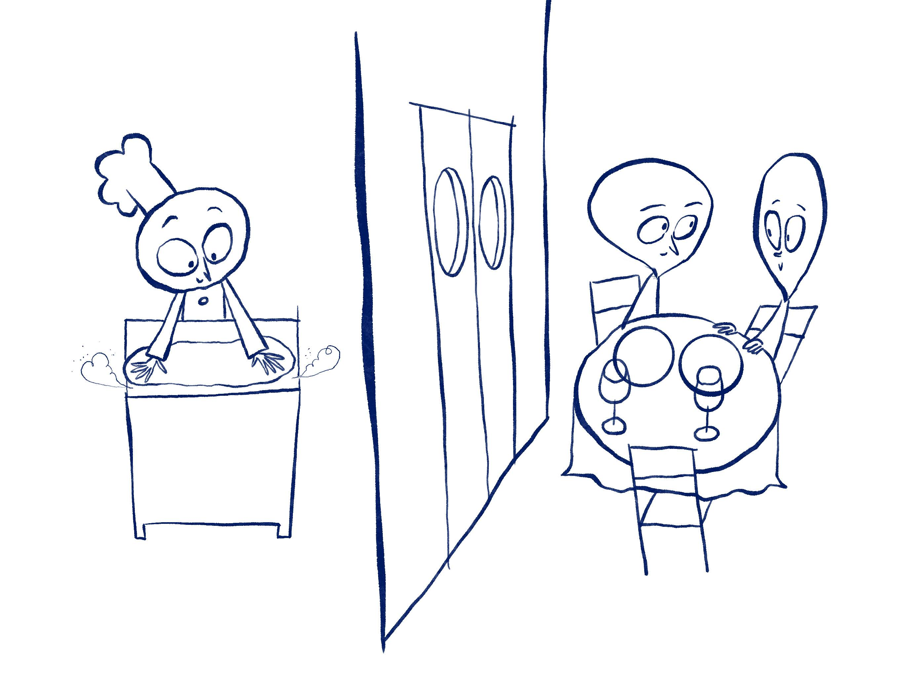
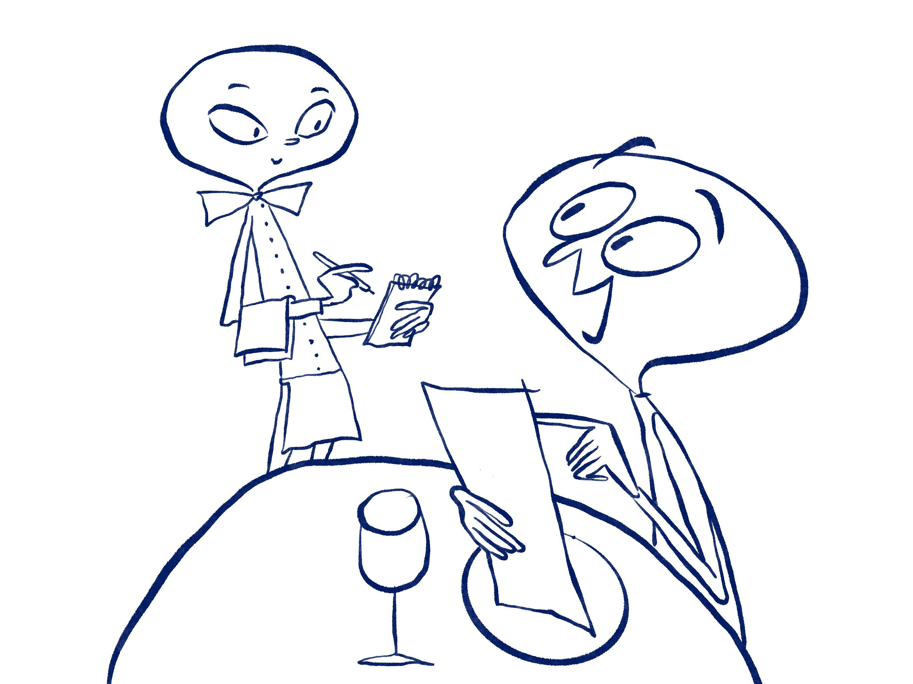
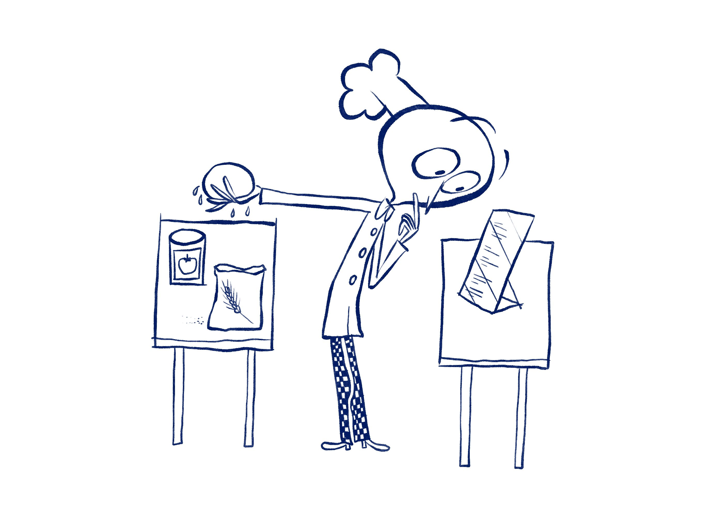
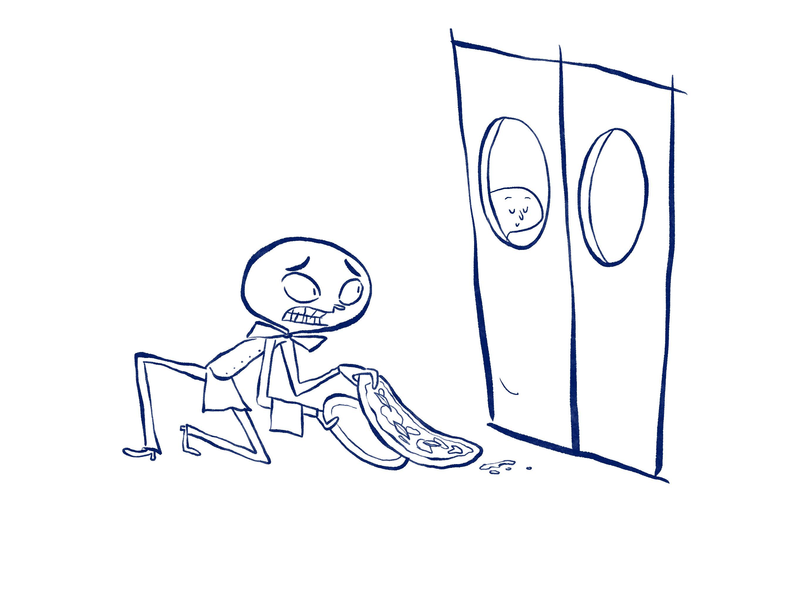

<h1>Algorithm</h1>

<figure>
  
  <figcaption>Fig 1 - To understand algorithms, let's go to the new pizzeria in town. You seat with the other customers in the dining area of the restaurant and don’t need to access or know how the kitchen works or the steps to make a pizza to be able to enjoy one.</figcaption>
</figure>

 

<figure>
  
  <figcaption>Fig 2 - All you need to know is how to read the menu and interact with to waiter to communicate what you would like to order.</figcaption>
</figure>

 

<figure>
  
  <figcaption>Fig 3 - The pizza intern receives the order and, in order to be able to prepare the pizza, reads the recipe. This is a list of instructions that will guide them through the ingredient and steps needed to prepare a pizza.</figcaption>
</figure>

 

<figure>
  
  <figcaption>Fig 4 - In the end though, unfortunately on the way back from the kitchen, the waiter drops the pizza on the floor. What will happen next? Whether it will be delivered to the customers depends on the pizzeria’s code of ethics.</figcaption>
</figure>

 

<h4>Understanding the analogy</h4>
You might have heard that programs called algorithms help digital technology function. An algorithm – similar to a pizza recipe – is a set of instructions. In this gap, an algorithm is explained by comparing it to pizza making.  The different pre-set components of an algorithm built by a developer are similar to the different toppings a pizza chef reads from the recipe or menu.

This is true for all algorithms regardless of how complicated the result is. In this gap, the pizzeria owner gives a pizza intern his recipes. The same way a software developer writes down (literally) a list of instructions for the computer to execute. As the pizza recipe contains a list of ingredients to be used and a step by step guide on how to combine them, an algorithm will define which pieces of information to use and what to do with them. The way your laptop, smartphone or any other digital device performs resembles what happens when you order a pizza like in the first two illustration. You will most likely be given some options of things you can do, for example write a document on Microsoft Word or send a message on WhatsApp the same way you are given a list of pizza options in the menu.

In our pizza making example, the waiter may write down in their notebook what you would like. The scenario just described is called “frontend” in computing terms and it means it’s the side of the algorithm you are exposed to. The waiter then goes to the kitchen and communicates your order to the chef. This and what happens next is the backend. The same way you don’t need to know how to make a pizza to enjoy one at your favourite pizzeria, you don’t need to know what happens in the backend of the program you are using. The computer (or pizza intern in our gap), will read the algorithm (or recipe in our gap) and this will be presented to you on the frontend the same way the waiter will bring you your delicious pizza.

Just to be precise, you might have noticed we have used the terms algorithm, program, code, software interchangeably. We could say that a program/code/software is built on a multitude of algorithms. However, nowadays, the term algorithm has absorbed the other ones and is used to define any digital product.

<h4>Why you should care </h4>
Computers are powerful machines, but as such, they don’t have the imagination to do things on their own. Similarly, in our analogy, the pizza intern knows very well how to use their tools, but always forgets what the recipe is. Therefore, every time they are asked to make a pizza, they have to check the recipe the same way a computer needs to read and execute the algorithm.

Just a small clarification, the types of algorithms described in this gap have been around for a long time and are still doing wonders, a new generation of algorithms called machine learning (or data driven or artificial intelligence) are gaining more and more attention. In these algorithms, the recipe is created along the process of making pizza. If you would like to know more about this topic, se the Machine Learning gap.

<h4>What you can do about this</h4>
So, if algorithms are just a set of instructions like a recipe, what is the big deal? Since computers and smart devices are becoming an essential component of our everyday lives, algorithms are also becoming more important as the instructions telling them how to operate. If they are just like a recipe, why sometimes there is a negative connotation attached to them? After all, a recipe is not bad in itself, unless we don’t like the dish prepared by them. In the gap above, if you went to a pizzeria and didn’t like their pizzas, you would simply not go back. The same way, if you downloaded an app that, for some reason, you didn’t like, you probably just deleted it or never used it again. So, what is the big deal? The big deal is that in the digital world, there are pizzas you can’t say no to. What we mean with this is that with computers being used in (almost) every aspect of life, algorithms will influence your life in ways that are beyond your control. Algorithms will decide what you see in your social media news feed (social media polarisation), if you are worth a loan or what your sentence should be if you are accused of committing a crime. In these aspects, they replaced human decisions by giving us very powerful impartial and objective tools that can assist us in making decisions. But wait a second, are they truly impartial and objective? A recipe is only as good as the intentions of the person who created it. So, in this way they are impartial. However, what if in the mushroom pizza, the recipe used by the pizza intern told them to use delicious, however slightly poisonous mushrooms. Maybe we wouldn’t notice at first, but by eating them over a long period of time we would feel sick. Or what if, as in the last illustration of our gap, the waiter dropped the pizza on their way to the table? We might not notice, eat it and find it delicious. However, you wouldn’t want to go to a restaurant that embraces these practices. Since you don’t have access to the kitchen (or backend), it is vital that external entities, such as hygiene regulators for a restaurant check on that for you, the customer or user of a digital product.

<h4>Look to the future</h4>
The ethics of a company will be reflected in their algorithms. It is, therefore, in your hands to decide if you want to use a certain piece of software based on who developed it. It is not always easy to boycott a product if it is ubiquitous. The first tech companies shaped the boundaries of what is acceptable or not in terms of ethics of algorithms. Because what they were doing was so new, there was no way for the general public to object. However, as time goes on and these companies become public and more technologists are involved in the development of digital products, there is a chance to raise ethical questions. The way we interact with algorithms now will shape the future in terms of what is acceptable or not from them. Even if most of them offer free services, it is up to us to understand how we are paying for these services and what we are ready to trade off in exchange for those free services.
