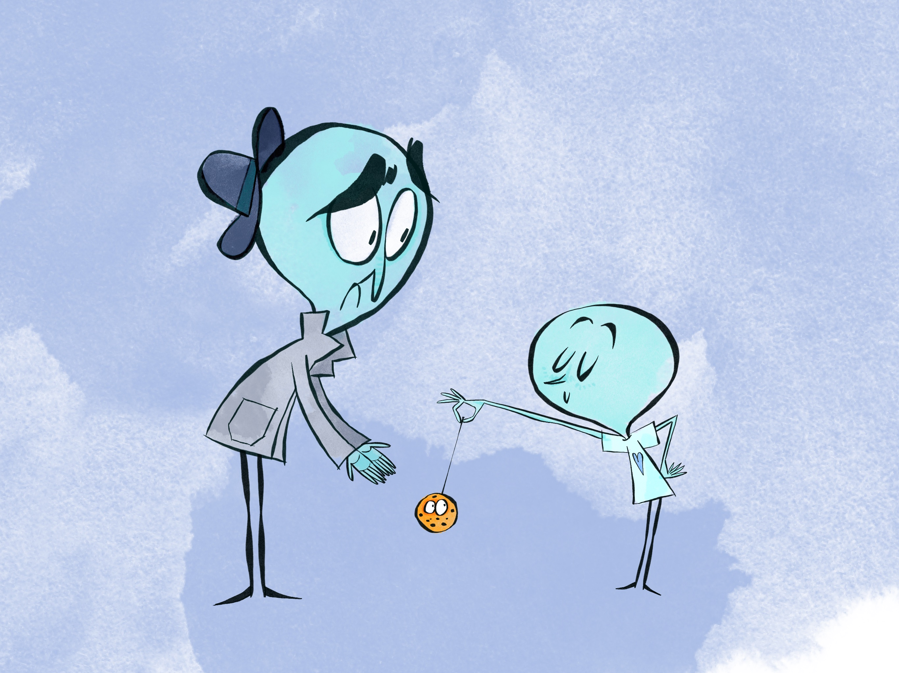

<h1>Cookies</h1>

<figure>
  
  <figcaption>Fig 1 - To understand internet cookies, let’s go shopping. As you go into a new shop, the shopkeeper sticks a tiny badge on you with your likes, dislikes and a quick name identifier. When you come back to the shop later, the shop assistant sees the badge and helpfully brings back the items you were interested in, and a few similar products too.</figcaption>
</figure>

 

<figure>
  
  <figcaption>Fig 2 - Somehow though, as you walk down the high street, several other shops also seem to know your details. Instead of one badge, you have multiple (third party) badges pinned from shops you don’t know.</figcaption>
</figure>

 

<figure>
  
  <figcaption>Fig 3 - The badge was originally intended to be helpful, and to allow us to keep shopping and pick up where we left off. In return, the shopkeeper could understand our opinions, improve their shop experience and recommend new products to sell.</figcaption>
</figure>

 

<figure>
  
  <figcaption>Fig 4 - In the end, badges have become sinister. They have become a way of shops sharing personal information without consent and without being monitored.</figcaption>
</figure>

 

<h4>Understanding the analogy</h4>
You might have heard that cookies are being placed on your computer or device during internet browsing. When you access a website – like if you enter a physical store – your activity is tracked. In this gap, the role of cookies online is explained by comparing it to a shopping trip in a clothing store.  Your shopping activity is tracked by having the sales assistant place a physical badge on your back, in a sort of sneaky way, so you don’t really notice.

The same thing happens when you visit a website – only instead of a physical badge, the website saves a tiny snippet of code in a file on your computer. The same way a sales assistant could tell what you were interested in, the website can store information about your behaviour, like whether you’ve visited the site before, which pages you have viewed, if you added something to your basket then left without finalising the purchase etc.

Why would a website want to spend time and resources to do to track your behaviour? Similar to our sales assistant who is badge-happy, there is a win win. Firstly, it allows for a more personalised experience. For example, the next time you go into the store they could ask you: “How did you enjoy the heart t-shirt you bought last time? If you are still interested in heart shapes, we have these amazing new items”. Secondly, it helps the store because by showing you items you are likely to like, you are also more likely to spend money. This is what cookies were originally tweaked to do: make online options more personalised/helpful, and ultimately allow users a more streamlined path towards commerce.

So what has gone wrong, and when does the internet go too far with cookies? In the third illustration of our gap, after finding their back is covered in unknown badges, the shopper is recognised by different sales assistants trying to sell other products. How does this scenario make you feel? You would probably question the sale assistant and ask them where they got their information from.  If you think about it, this is now the norm online. How many times have you seen something advertised on social media or a website, after browsing that item a few days before? These are called third party cookies to highlight the fact they come from a website that is not the one you were visiting. This is where many argue cookies have gone too far. Your browsing and device information has been shared across websites, advertisers and brands, and resulted in you being followed across websites, social media and advertising companies. The whole process has been slow and subtle using technologies that most of us do not understand. So, let’s see why at Electric Gap we believe it is important to understand what is going on.

<h4>Why you should care </h4>
Personal information is an asset, and our personal and physical privacy is important. There are pieces of information about ourselves that we value and do not want to be shared. For example, we do not want people to know where we live when we walk passed strangers in the street. When we disclose personal information, we do it with institutions we trust and with the expectation it will not be shared. When we trade off some personal information, we expect something in return or at least that it’s not going to be shared without our knowledge and consent.

It may not seem like a big deal that companies know which pages we look at on the internet, or that they gather uninteresting information about us.  However, the information that companies and advertising agencies access when using third party cookies is often not monitored or open. The level of customisation many companies reach to make individual users spend money is unfair and not accessible.

More concerning still, is that this volume of shared data allows companies to build models that will predict our behaviour. Companies can show you products you are not even aware yet you may want, and the predictive power of large amounts of data has been used for scarier goals such as manipulating the result of elections (like the Cambridge Analytica scandal).

The reason for the escalation of private information, is largely because most online companies started operating in a completely unexplored field. Therefore, they dictated the rules of the game and only now, some 30 years later, legislators are understanding the importance of regulating the internet. The internet is a free service, you pay for the infrastructure to connect to it (your mobile data plan or your broadband), you might pay for services such as the subscription to an online publication, but you don’t share the cost companies have to run the services they provide. The easiest example we can think of is Google. Google runs massive data centers to provide their service, employ thousands of talented people, they are one of the richest companies on the planet and still never asked you to pay for their Search and other services. The short and a bit outdated answer is through advertising and for the long answer you can have a look at the XXX gap.

<h4>What you can do about this</h4>
One of the main things to avoid oversharing, is being more careful online. In terms of cookies:

- this mean spending that extra second to only select the “essential” or “technical” cookies from website popups (the are the ones represented in the first illustration) and not accept third party cookies (do not press the “Agree all” button that tends to be the big and bright one).
- use browsers or technology in a way that protects, like Google Chrome settings that allow you to block third party cookies in their settings, and Apple Safari and IOS updates are now taking a hard line stance on data sharing and privacy.
- clearing your internet cache can help ensure historical cookie data is not kept on your device

<h4>Look to the future</h4>
The good news is that third party cookies are going away. Legislation like the GDPR, CCPA and other market specific laws have focused on holding companies accountable for the information they are storing and sharing digitally. On top of this, major technology companies like Apple and Chrome have committed to the deprecation of the cookie over the next couple of years. The hope is that the new technologies that inevitable arise online will be fairer and more transparent for the user. They are also required to lose the level of granularity that allow companies to gather so much specific personal information.
