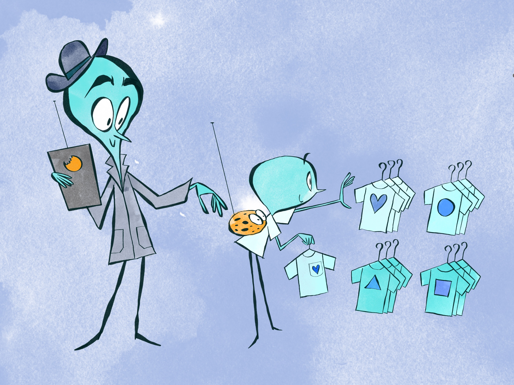
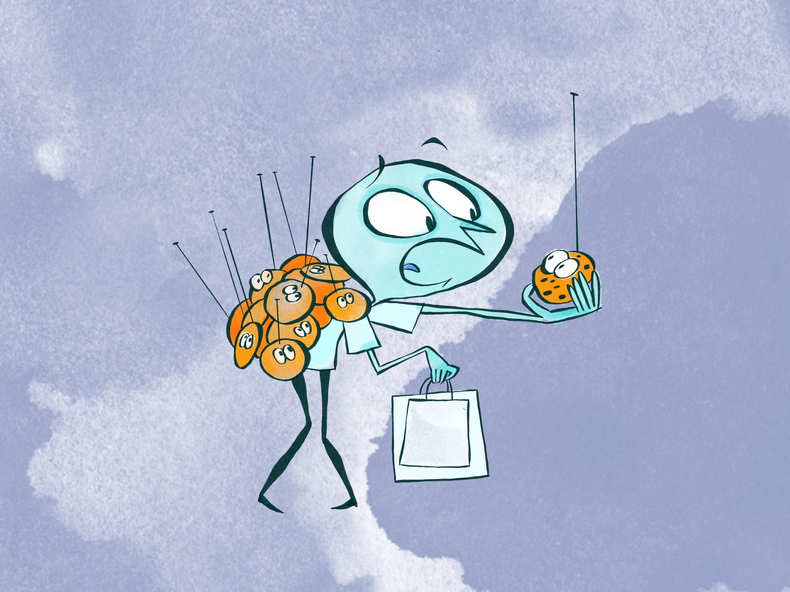
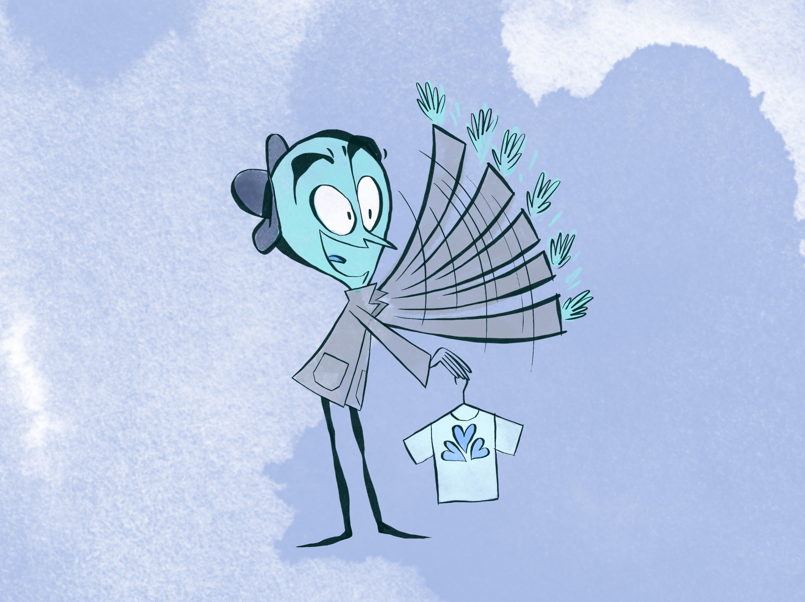
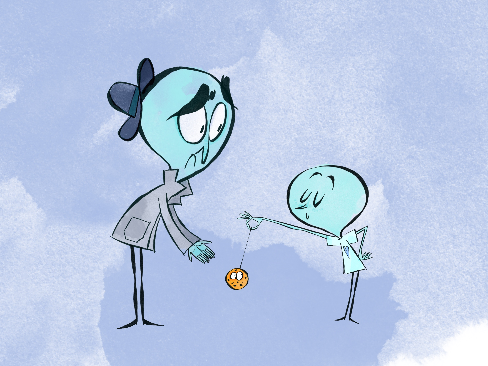

<h1>Cookies</h1>

<figure>
  
  <figcaption>Fig 1 - To understand internet cookies, let’s go shopping. As you go into a new shop, the shopkeeper sticks a tiny badge on you with your likes, dislikes and a quick name identifier. When you come back to the shop later, the shop assistant sees the badge and helpfully brings back the items you were interested in, and a few similar products too.</figcaption>
</figure>

 

<figure>
  
  <figcaption>Fig 2 - Somehow though, as you walk down the high street, several other shops also seem to know your details. Instead of one badge, you have multiple (third party) badges pinned from shops you don’t know.</figcaption>
</figure>

 

<figure>
  
  <figcaption>Fig 3 - The badge was originally intended to be helpful, and to allow us to keep shopping and pick up where we left off. In return, the shopkeeper could understand our opinions, improve their shop experience and recommend new products to sell.</figcaption>
</figure>

 

<figure>
  
  <figcaption>Fig 4 - In the end, badges have become sinister. They have become a way of shops sharing personal information without consent and without being monitored.</figcaption>
</figure>

 

<h4>Understanding the analogy</h4>

<h4>Why you should care </h4>

<h4>What you can do about this</h4>

<h4>Look to the future</h4>
