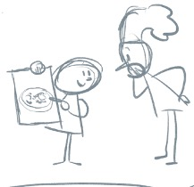
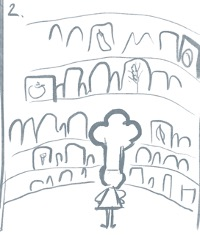
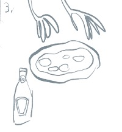
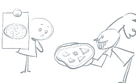

<h1>Cookies</h1>

<figure>
  
  <figcaption>Fig 1 - You try this new pizzeria in town. What is special about it is that instead of ordering from their menu, you just show the chef the image of the pizza you would like.</figcaption>
</figure>

 

<figure>
  
  <figcaption>Fig 2 - Back in the kitchen, the chef has a big cupboard full of ingredients to choose from. What happens next is that they try and combine the ingredients in a trial and error fashion until the desired result is achieved.</figcaption>
</figure>

 

<figure>
  
  <figcaption>Fig 3 - The process can be tricky. For example, they need to make not to use ketchup instead of tomato passata. This mistake happened in the past, so they know how to do better now.</figcaption>
</figure>

 

<figure>
  
  <figcaption>Fig 4 - At the end, here I your pizza. It looks great, but.. wait a second, is that coconut slices instead of mushroom? It might be delicious, but not really what you asked for, is it?</figcaption>
</figure>

 

<h4>Understanding the analogy</h4>
In this gap, the working behind machine learning is compared to a new pizzeria. It’s a special type of pizzeria because instead of having a menu you can choose from, you can just show the chef a picture of what you would like and they will make sure to produce it for you. Let’s see how they achieve this.

If this is not your first time at Electric Gap, you might have noticed that we are very fond of pizzas and pizzas analogies. So much so that we used it to explain what an algorithm is. If you haven’t read the Algorithm gap, we recommend you read through that one before venturing onto machine learning. The reason for this being that machine learning is a type of algorithm, but it operates in a slightly different way with respect to a classical one.

Traditional algorithms are a list of instruction, such as a pizza recipe. This recipe was given to the chef by someone else and they both know what it does. If they shared it with you, you would be able to understand it too (we will explain below why this is an important point). However, in this gap we saw that the chef wasn’t consulting any pre existing recipe.

The only information provided to the machine learning chef is the final desired result. They also have at their disposal all the ingredients in the kitchen instead of just the ones that they need to prepare that specific pizza. Of course, the chef needs to be able to combine ingredients and use the kitchen, but they don’t need to have prepared this specific pizza any time before because they will learn on the fly. The only way they can do that is by trial and error. This means that they will need to create several pizzas (maybe thousands) where at each step some ingredient is added or removed. For example, to make a pizza dough, you need roughly XX parts of flour and XX parts of water. At some point, the chef has identified that those two ingredients are needed to make the pizza (remember that there is no assumptions, so they really need to try them all). Then they mix different proportions of these two ingredients and assess the newly produced dough with respect to the last one. If by increasing the amount of flour the result looks better, then the chef will make a new dough with an even larger amount of flour. At some point, however, the new dough will be worse than the precedent one and that is when the chef knows it is time to stop increasing the amount and actually going back to the last proportions

This sounds very complicated and daunting, but remember that the machine algorithm chef is incredibly fast, so it’s really just a matter of seconds or minutes to try all these combinations.

Finally, this process generated a pizza that looks like the one you requested. Also, by keeping track of the whole process, the chef is now able to prepare that type of pizza and the next time you or someone else requests it, they won’t waste time going through the whole process because the first time they produced it, they have generated the recipe. What is different, from a normal recipe, as we hinted above, is that this recipe was not passed on by someone and maybe for a simple dish such as a pizza you would be able to understand it, but what about a complicated one? We will come back to this point later.

Overall, it’s a pretty cool achievement if you think that the restaurant can prepare any dish you’d like in a matter of minutes. Isn’t that much more appealing than a traditional restaurant where there is only a set list of dishes you can order from. So, now let’s dig a bit deeper into this process and see how things could go wrong.

<h4>Why you should care </h4>
Let’s go back to the assembling process. Let’s say we managed to prepare the base, now we need to start thinking about the toppings and the one we showed the ML chef is a mushroom pizza. So, the next step will be tomato sauce. They try with Nutella (remember they have all the possible ingredients) and compare the result to the demonstration pizza. This will of course be farther away from the ideal result we want to achieve. Therefore, they will register that Nutella is not an improvement in their recipe. At some point on the list of ingredients there is tomato sauce and they can see that the result is looking more and more like the final product we want. However, what would have happened if instead of tomato passata the chef had found ketchup? The pizza would look pretty much like the desired one. We are in luck because this mistake was already committed by the chef and since the customer complained, the chef has been instructed to make sure and double check whether it's ketchup or tomato sauce that is needed. Unfortunately for us, however, the kitchen has run out of mushroom. The chef will not see this as a problem, they will try to deliver the closest possible approximation to the pizza we requested and replaces mushroom with coconut slices. Not really what we expected, right? This is going to be a bad experience for us and everyone that requests a mushroom pizza and ends up with a coconut one.

This type of algorithm influences all aspects of your life. In particular when it comes to social behaviour. This is because we don’t have exact recipes to describe and predict humans and society. For example, we don’t have a recipe to predict if you are likely to repay a loan or not. There are so many factors to take into account that we cannot even start to think about it. However, we can give the machine learning algorithm information about people that asked for a loan in the past and whether they repaid it or not. In this case the ingredients won’t be flour, water and passata, but pieces of information such as age, level of education, annual income, home address etc. The final result won’t be a pizza, but a number between 0 and 100 that will tell us how likely you are to repay the loan you are asking for. This is fantastic and it really looks like the computer is thinking for itself. After all we gave it information and asked to produce something without explaining the steps to get there. What is actually happening is that we trained the algorithm with some data and the computer generates the best answer to that problem. What would happen if something went wrong like the coconut/mushroom misunderstanding? Most times, the result of an issue like this would be much more serious than a pizza mistake.

One other issue is that the pieces of information we train the algorithm on will change its shape and result. This can lead to something called algorithmic bias and to be fair, it’s not the algorithm that is biased, it’s the way we trained it. This means that if the data we used (like the ingredients that the chef has is the kitchen) contain an inherent bias, the algorithm will only replicate that. Therefore, if people in a certain area tend not to repay loans, but also the inhabitants of that area mostly belong to an ethnic minority, then the algorithm will be discriminating people based on their ethnicity. There are several ways to ensure this doesn’t happen (see the external links below).

<h4>What you can do about this</h4>
Machine learning algorithms are rapidly reaching every aspect of technology. In particular, tech companies rely more and more on these technologies in order to deliver a better experience to their customers.

Another broad and important field where these algorithms are becoming more and more important is decision making, where it is believed that a machine will be able to be impartial. We have already discussed how this might not be the case.

Unfortunately, as these algorithms become more and more widespread, both in terms of applications and in number of users, it become more complicated to decide not to use them. This is also because tech companies are not overly keen to share the working behind their algorithms, both for protecting their intellectual property and to avoid public scrutiny.

On a personal level, there might be little we can do. This is because most times we ither have no choice but to use a specific algorithm or because an external organisation or institution might be using those algorithms to profile us. Well known examples are the XX and XX and you can read more about them in the links below.

What is important is to be aware that there are organisations fighting for algorithmic fairness. You can find a list of these in the external resources. If you think an unfair treatment, you have been subjected to is the consequence of “algorithmic unfairness” you can find resources on their websites about what tools you can use to combat that.

<h4>Look to the future</h4>
The abuse of machine learning algorithms threatens the future of a fair and equal society for the last few years. However, as technologists speak up about the risk these technologies can represent and as regulators understand the magnitude of the threat, these practices will receive a higher level of scrutiny. This is why pieces of legislation such as the European GDPR are so crucial. 
